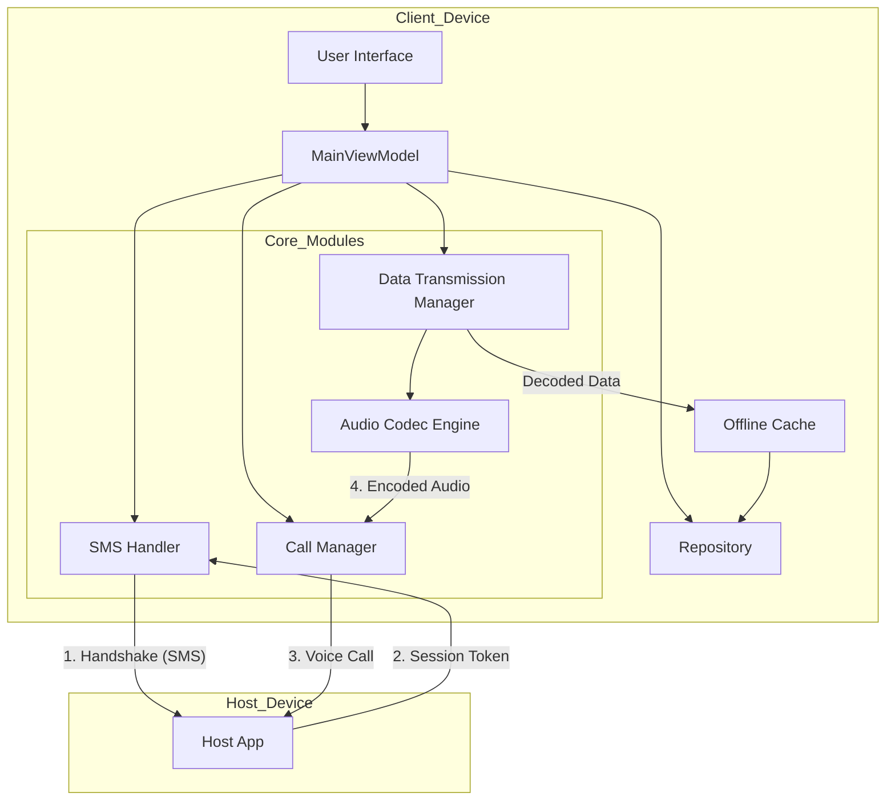

# Vidya Sarthi 🚜📡

> **Bridging the digital divide using voice-data technology.**

  

**Vidya Sarthi** (Education Charioteer) is a mobile application designed to enable rural users with limited or no internet access to receive web content (tutorials, weather, news) over cellular voice calls using acoustic modem technology.

---

## 📑 Table of Contents

1. [Project Summary](#1-project-summary)
2. [Why Vidya Sarthi?](#2-why-vidya-sarthi)
3. [Features](#3-detailed-features)
4. [User Manual](#4-user-manual)
5. [Developer Manual](#5-developer-manual)
6. [Testing Strategy](#6-testing-strategy)
7. [Security & Privacy](#7-security-and-privacy)
8. [Deployment Notes](#8-deployment-notes)
9. [Architecture](#9-architecture)

---

## 1. Project Summary

**Vidya Sarthi** revolutionizes information access in deep rural pockets where 4G/5G data is unreliable but 2G/GSM voice coverage is ubiquitous. By encoding digital data into audio tones (FSK/PSK) and transmitting them over standard voice calls, the app creates an "Internet without Internet" experience.

**Key Capabilities:**
- **No Data Plan Needed:** Uses voice minutes for data transfer.
- **Accessible UI:** Voice-first interface for low-literacy users.
- **Resilient:** Works on standard GSM voice channels (300Hz - 3400Hz).

---

## 2. Why Vidya Sarthi?

### The Context: India and Developing Nations
While mobile penetration is high, reliable high-speed internet remains a challenge in remote villages.

### Key Statistics & Impact
*   **Ubiquitous Voice Coverage:** In India, 2G/3G voice coverage exceeds **98%** of the population, whereas stable data coverage drops significantly in remote areas.
*   **The Literacy Gap:** A significant portion of the rural population benefits from voice-guided interactions over text-heavy interfaces.
*   **Cost Efficiency:** Voice minutes are often unlimited in modern telecom packs, making this a cost-effective data transport layer.
*   **Disaster Resilience:** Voice networks are often more resilient or prioritized during emergencies compared to packet data networks.

---

## 3. Detailed Features

| Feature | Description |
| :--- | :--- |
| **SMS Handshake** | Secure connection initiation via SMS to validate users and exchange session tokens before the voice call. |
| **Content Selection** | Users can select the type of content they want to receive (e.g., Weather, Agriculture, News). |
| **Acoustic Data Modem** | Encodes digital content into audio tones within the 300Hz-3400Hz voice band. |
| **Voice Call Conference** | Supports multi-client broadcasting to serve multiple users simultaneously. |
| **Offline Caching** | Intelligently caches content for offline access. |
| **Voice-First UI** | Speaks to the user ("Connection Established", "Receiving Data") in local languages. |
| **Error Correction** | Implements CRC and ACK/Retry mechanisms to handle channel noise and packet loss. |
| **Smart Compression** | Compresses text and data using GZIP to maximize throughput over the low-bandwidth channel. |
| **Security** | AES-128 encryption ensures that data transmitted over the voice line cannot be intercepted or spoofed. |

---

## 4. User Manual

### **Target Audience:** Rural Users (Low Technical Literacy)

### **Step 1: Setup**
1.  Open the **Vidya Sarthi** app.
2.  The app will welcome you with a voice prompt.
3.  Grant the necessary permissions (Phone, SMS, Microphone) when asked.

### **Step 2: Connect to Host**
1.  Enter the **Host Phone Number** in the provided box on the Home Screen.
2.  Select the desired **Content Type** from the dropdown menu.
3.  Tap the **"Connect via SMS"** button.
4.  Wait for the voice prompt: *"Connection Initiated"*.
5.  Once accepted, the app will say *"Connection Established"*.

### **Step 3: Receive Content**
1.  Tap **"Start Voice Call"** or answer the incoming call from the Host.
2.  **Important:** Do not speak during the call. You will hear data sounds (screeching tones).
3.  Tap **"Start Receiving Data"**.
4.  The app will show a progress indicator and speak *"Receiving content"*.
5.  Once done, the call ends, and the app says *"Content received successfully"*.

### **Step 4: View Content**
1.  Go to the **Content** tab (House icon).
2.  Select the appropriate content category to view the downloaded information offline.

---

## 5. Developer Manual

### **Environment Setup**
*   **IDE:** Android Studio Koala or newer.
*   **Language:** Kotlin 2.0+.
*   **JDK:** Java 11 or 17.
*   **Min SDK:** 21 (Android 5.0) | **Target SDK:** 36.

### **Build Instructions**
1.  Clone the repository:
    ```bash
    git clone https://github.com/chaitana2/Vidya-Sarthi.git
    ```
2.  Open in Android Studio.
3.  Sync Gradle files.
4.  Build the APK:
    ```bash
    ./gradlew :app:assembleDebug
    ```

### **Key Components**
*   `core/audio`: `AudioEncoder` (Tone Gen) & `AudioDecoder` (Goertzel/FFT).
*   `core/transmission`: `DataTransmissionManager` (Packet flow, Retries).
*   `core/sms`: `SmsHandler` (Handshake protocol).
*   `core/call`: `CallManager` (Telecom integration).

### **Debugging**
*   Filter Logcat by tag `DataTransmissionManager` to see packet flow.
*   Use `VidyaSarthiRepository` logs displayed on the UI for field debugging without a PC.

---

## 6. Testing Strategy

### **Unit Testing**
*   **Tools:** JUnit 4.
*   **Focus:** Verify `AudioUtils` tone generation frequency accuracy and `ErrorCorrection` CRC calculations.

### **Integration Testing**
*   **Scenario:** Simulate SMS reception triggering `SmsHandler`, validating the state update in `MainViewModel`.
*   **Audio Loopback:** Test `AudioEncoder` output feeding into `AudioDecoder` on the same device to verify codec integrity.

### **Field Testing**
*   **Noise Resistance:** Test in environments with background noise (marketplaces, wind) to tune `AudioDecoder` sensitivity.
*   **Latency:** Measure time from "Send" to "ACK" over real GSM networks.

---

## 7. Security and Privacy

*   **Encryption:** All data payload is encrypted using **AES-128** before transmission.
*   **Authentication:** PIN-based session tokens prevent unauthorized connections.
*   **Permissions:** 
    *   `RECORD_AUDIO`: Strictly used for data decoding. No voice is recorded.
    *   `SEND/RECEIVE_SMS`: Used strictly for handshake signaling.
*   **Privacy:** Local-first architecture. No user data is uploaded to external cloud servers by the app itself.

---

## 8. Deployment Notes

### **Play Store Guidelines**
*   **Permissions Declaration:** You must declare the use of `SEND_SMS` and `CALL_PHONE` in the Play Console, categorizing the app as a "Companion Device" or "Default Handler" depending on the exact feature set, or request an exception for "Physical Safety / Critical Infrastructure" if applicable.
*   **Store Listing:** Clearly explain that the Microphone is used as a data modem.

---

## 9. Architecture



---
**Vidya Sarthi** - Empowering Rural Connectivity.
